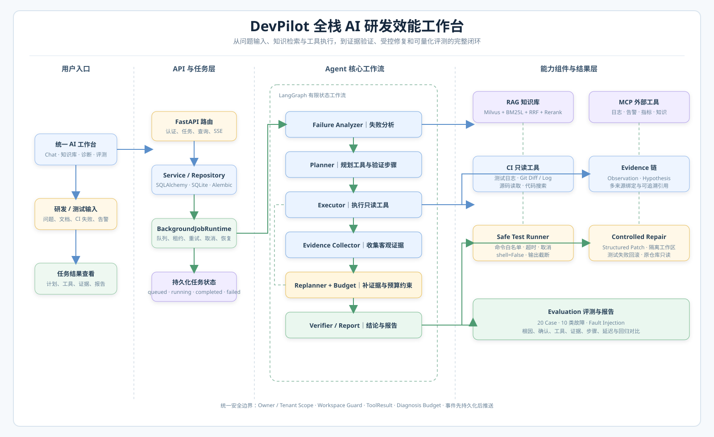
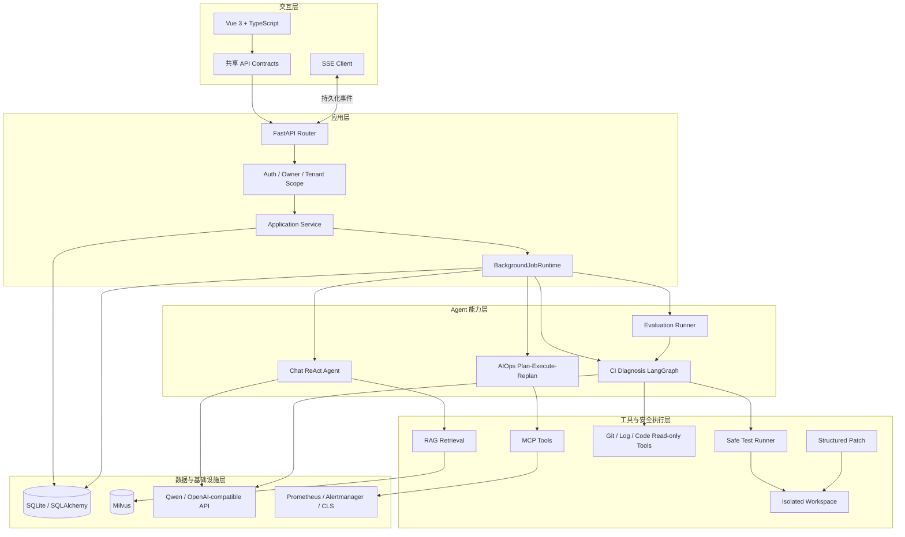
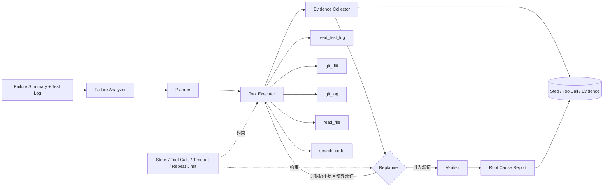
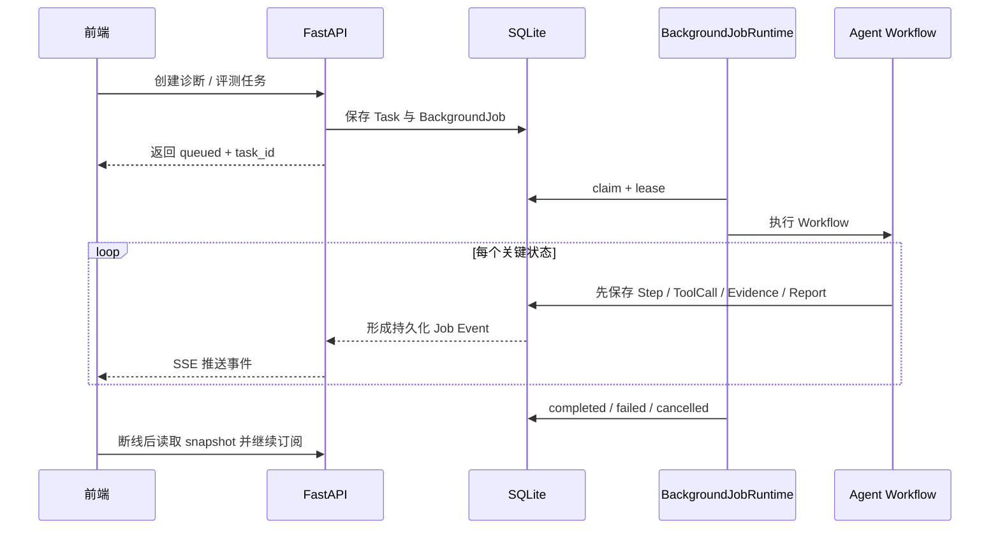
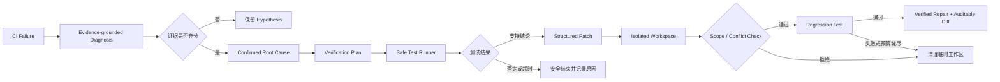
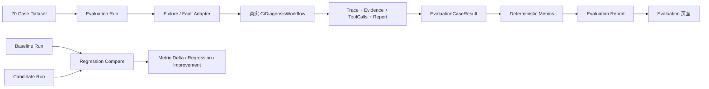

# DevPilot 系统架构

本文只描述当前仓库已经实现的模块与调用关系，不包含规划中的能力。

## 一、系统总览

前端通过共享 Contracts 调用 FastAPI；长耗时任务统一交给 BackgroundJobRuntime。Chat、AIOps、CI Diagnosis 和 Evaluation 复用认证、任务、持久化与 SSE 基础设施。

## 二、CI 智能诊断工作流

CI Diagnosis 使用 LangGraph 编排有限状态工作流：

- **Failure Analyzer**：deterministic regex/structured parser 优先，抽取失败上下文。
- **Planner**：根据分析结果生成有序工具计划。
- **Executor**：执行只读 Developer Tools，统一返回 ToolResult，并记录 ToolCall。
- **Evidence Collector**：把客观工具结果转换为结构化 Evidence 并持久化。
- **Replanner**：根据证据缺口补充安全工具调用，同时受步骤、工具调用和重复调用预算限制。
- **Verifier**：检查多个独立 Evidence、Evidence 类型和结论一致性。
- **Report**：输出 confirmed root cause 或 hypothesis，并绑定 Evidence IDs。

## 三、异步任务与实时事件

API 请求只创建 Task 和 BackgroundJob，不同步执行完整 Agent。Runtime 负责 claim、lease、heartbeat、retry、cancel、恢复和幂等。CI Diagnosis、Evaluation Run、CI Repair 使用统一 Runtime，不创建第二套 Worker。

## 四、证据约束、测试验证与受控修复

### Evidence Grounding

Evidence 只能代表工具或外部数据产生的客观 Observation，包含 type、source、summary、content、metadata、taskId 和关联 ToolCall。Hypothesis 独立存在，引用 supporting/contradicting Evidence IDs。没有足够独立 Evidence 的结论只能是 hypothesis。

### Safe Test Runner

Safe Test Runner 通过 `create_subprocess_exec` 且 `shell=False` 执行，仅允许 `pytest` / `python`，检查相对测试路径和 Workspace Root，支持 timeout、取消、输出截断和错误规范化。测试结果作为 ToolResult、ToolCall、Evidence 和 Trace 的一部分保存。

### Isolated Repair

Repair 使用 StructuredPatch 表达 path、old_text、new_text，并校验绝对路径、`..` 路径、allowlist 和唯一上下文。IsolatedWorkspace 将原始仓库复制到临时目录，Patch 只应用于副本；测试完成后临时目录清理，原始仓库保持只读。

## 五、Agent Evaluation

Dataset → Evaluation Run → 真实 CiDiagnosisWorkflow → CaseResult → Metrics → Report。EvaluationRun 和 EvaluationCaseResult 使用 SQLAlchemy/Alembic 持久化。规则型指标优先，保留 model、prompt_version、workflow_version、trace、evidence、tool calls、latency 和 failure reason。

## 六、安全与可靠性边界

| 边界 | 当前实现 |
|---|---|
| 身份与数据 | Auth、Owner/Tenant 查询约束，服务端执行授权判断 |
| Workspace | Workspace Root 校验、路径规范化、越界拒绝 |
| Developer Tools | 只读 Git、日志和源码工具，不暴露任意 Shell |
| 测试执行 | 命令白名单、`shell=False`、超时、取消、输出截断 |
| Patch | Structured Patch、文件范围限制、冲突检测 |
| 原始仓库 | Patch 仅应用于隔离副本，不自动 Commit / Push / PR |
| Agent 循环 | 最大步骤、最大工具调用、重复调用和总超时预算 |
| 后台任务 | Lease、Heartbeat、Retry、Cancel、Recovery、Idempotency |
| 事件一致性 | 业务状态先持久化，再产生 SSE 事件 |

## 七、SSE、持久化与权限

重要任务状态先持久化，再通过 SSE 发送。SSE 事件来自持久化 Job Event，客户端可用 task snapshot 恢复。认证使用现有 AuthService，查询按 owner/tenant scope 过滤；前端不参与授权判断。
